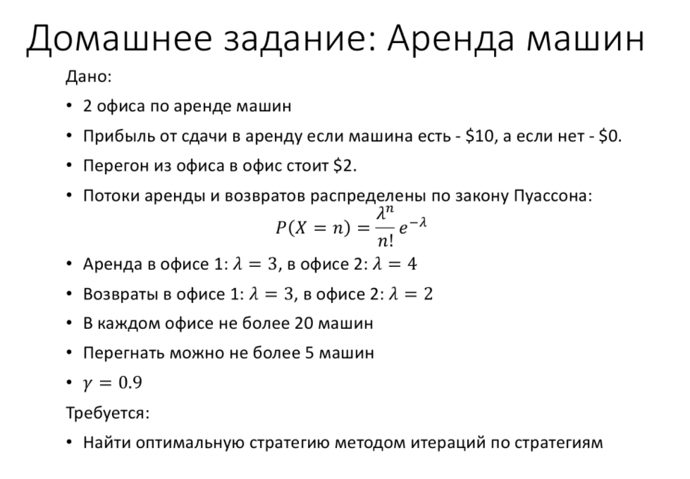

# Задача "Аренда машин (Jack’s Car Rental)"

Джек управляет двумя офисами национальной компании по аренде автомобилей. Каждый день в каждый офис приходят клиенты чтобы арендовать автомобиль. Если у Джека есть свободная машина, то он сдаёт её в аренду и получает от компании 10 долларов. Если машин не окажется, то он упустит выгоду. Машины становятся доступны для аренды на следующий день после возврата. Чтобы всегда иметь свободные машины, Джек может ночью перегонять их из одного офиса в другой, каждый перегон обходится в 2 доллара. Будем предполагать, что количество запрошенных и возвращённых машин в каждом офисе - пуассоновские случайные величины, т.е. вероятность что число равно n составляет , где  - математическое ожидание. Предположим, что для количества запросов в первом и втором офисах  равно 3 и 4 соответственно, а для количества возвратов - 3 и 2. Чтобы немного упростить задачу, предположим, что в каждом офисе может быть не более 20 машин (все лишние машины возвращаются компании и в задаче не фигурируют), а за ночь из одного офиса в другой можно перегнать не более пяти машин. Примем, что коэффициент обесценивания , и будем рассматривать эту задачу как непрерывный конечный МППР, где временной шаг равен одному дню, состоянием является количество машин в каждом офисе в конце дня, а действием - количество машин, перегнанных из одного офиса в другой за ночь.
